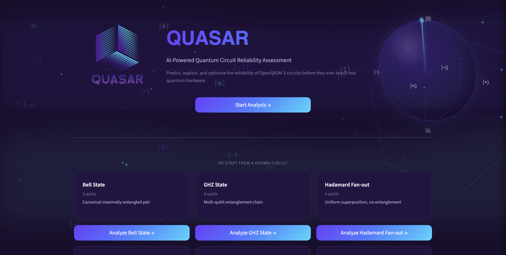
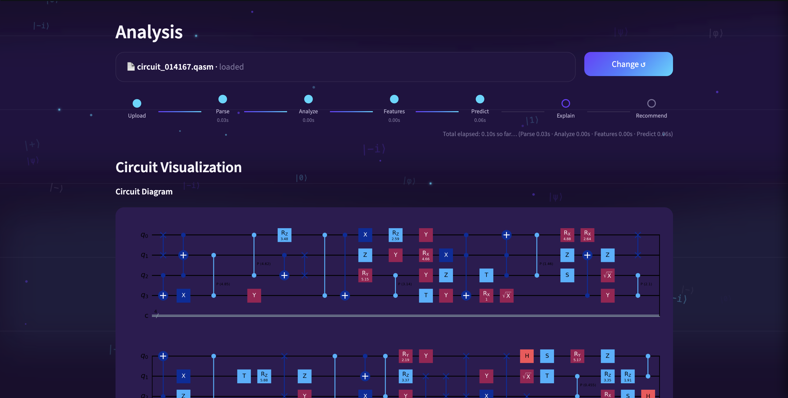
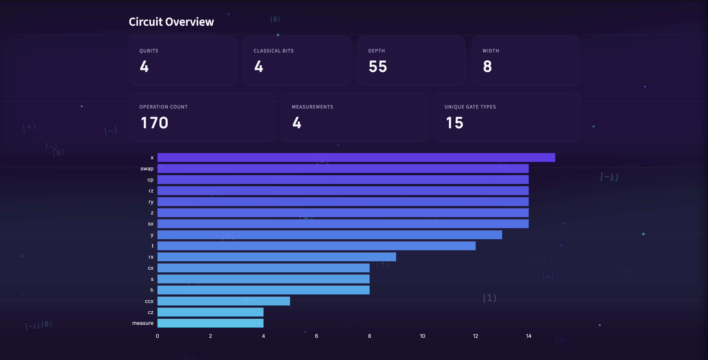
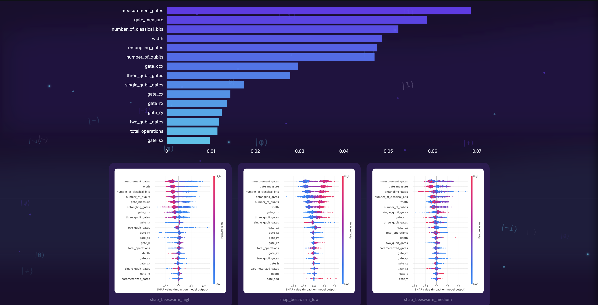
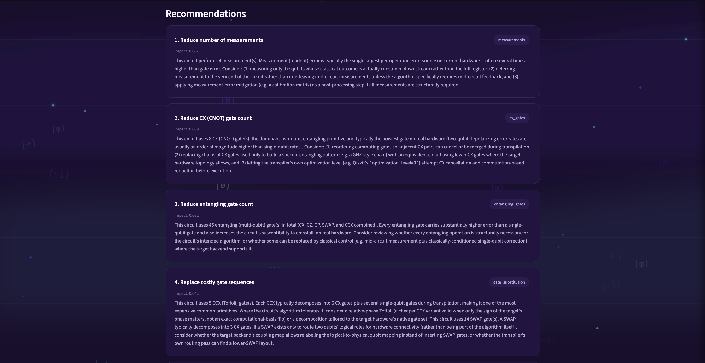

<p align="center">
  
</p>

<h1 align="center">QUASAR</h1>

<h3 align="center">Quantum Understanding and Assessment System for Reliable Analysis</h3>

<p align="center"><b>An AI-Assisted Quantum Circuit Reliability Analysis Platform</b></p>

---

## Overview

**QUASAR (Quantum Understanding and Assessment System for Reliable Analysis)** is an AI-assisted platform that evaluates the reliability of quantum circuits before execution on noisy quantum hardware.

By combining **Qiskit**, **Machine Learning**, **Quantum Noise Simulation**, and **Explainable AI (SHAP & LIME)**, QUASAR predicts circuit reliability, explains the reasoning behind each prediction, and provides recommendations for improving circuit robustness.

---



---

## Problem Statement

Current quantum computers operate in the Noisy Intermediate-Scale Quantum (NISQ) era, where gate errors, decoherence, and measurement noise reduce execution reliability. Assessing circuit reliability before deployment is therefore an important challenge for researchers and developers.

QUASAR addresses this by providing a unified pipeline for circuit analysis, reliability prediction, explainability, and recommendation generation.

---

## Key Features

- OpenQASM circuit parsing
- Quantum feature extraction
- Quantum noise simulation
- Gradient Boosting reliability prediction
- SHAP explainability
- LIME explainability
- Recommendation engine
- Interactive Streamlit dashboard
- Dataset generation and validation
- Evaluation reports and visualizations

---

## Repository Structure

```text
QUASAR
│
├── assets/              Project logo and static assets
├── circuits/            Sample OpenQASM circuits
├── datasets/            Training dataset and metadata
├── models/              Trained model and preprocessing artifacts
├── plots/               Evaluation and visualization outputs
├── reports/             Generated reports
├── src/                 Core implementation modules
│
├── app.py               Streamlit application
├── main.py              Main analysis pipeline
├── generate_dataset.py  Dataset generation utility
├── README.md
├── LICENSE
├── CHANGELOG.md
├── requirements.txt
└── pyproject.toml
```

---

## Core Modules

| Module | Description |
|---------|-------------|
| `parser.py` | Parses OpenQASM circuits. |
| `feature_extractor.py` | Extracts circuit-level features. |
| `noise_simulator.py` | Simulates noisy quantum execution. |
| `dataset_generator.py` | Generates machine learning datasets. |
| `dataset_validator.py` | Validates generated datasets. |
| `train_model.py` | Trains the reliability prediction model. |
| `evaluate_model.py` | Evaluates model performance. |
| `inference.py` | Performs reliability prediction. |
| `explainability.py` | Generates SHAP and LIME explanations. |
| `recommendation_engine.py` | Produces reliability recommendations. |
| `analyzer.py` | Coordinates the complete analysis workflow. |

---

## Technology Stack

- Python
- Qiskit
- Qiskit Aer
- Scikit-learn
- SHAP
- LIME
- Streamlit
- Plotly
- Pandas
- NumPy

---

## Installation

Clone the repository:

```bash
git clone https://github.com/YKMadhav/QUASAR.git
cd QUASAR
```

Install the required dependencies:

```bash
pip install -r requirements.txt
```

Launch the Streamlit application:

```bash
streamlit run app.py
```

After launching the application, open the local Streamlit URL displayed in the terminal (typically `http://localhost:8501`) and upload an OpenQASM circuit for analysis.

---

## Sample Circuits

QUASAR includes a collection of sample **OpenQASM** circuits for testing and experimentation.

These circuits are organized into the following categories:

- **Basics** – Fundamental quantum gates and simple circuits
- **Algorithms** – Common quantum algorithms (e.g., GHZ, QFT)
- **Advanced** – More complex quantum circuits
- **Custom** – User-defined and mixed circuits
- **Edge Cases** – Empty and invalid circuits for validation testing

Use these circuits to explore the complete analysis pipeline without creating your own OpenQASM files.

---









---

## Platform Compatibility

QUASAR has been developed and tested on **macOS**.

Compatibility with Windows and Linux has not yet been verified. Users on other operating systems may need to make minor environment or dependency adjustments before running the project.

---

## Author

**Khatwang Madhav Yippili**

---

## License

Released under the MIT License. See the `LICENSE` file for details.
