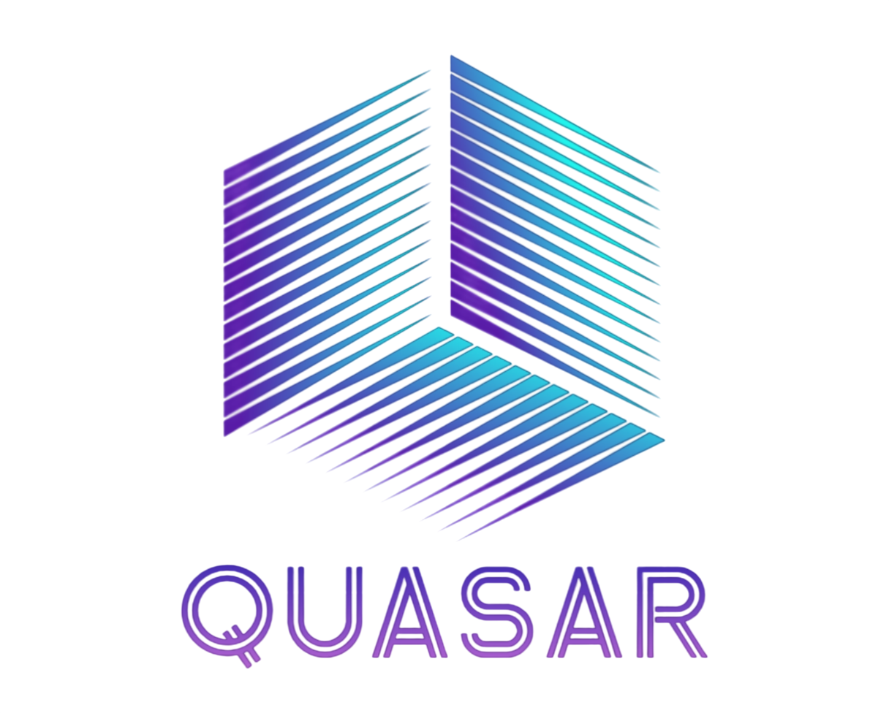

<p align="center">
  
</p>

<h1 align="center">QUASAR</h1>

<h3 align="center">
Quantum Understanding and Assessment System for Reliable Analysis
</h3>

<p align="center">
<b>An AI-Assisted Quantum Circuit Reliability Analysis Platform</b>
</p>

---

## Overview

**QUASAR (Quantum Understanding and Assessment System for Reliable Analysis)** is an end-to-end platform for analyzing the reliability of quantum circuits before execution on noisy quantum hardware.

Built using **Qiskit**, **Machine Learning**, **Quantum Noise Simulation**, and **Explainable AI (SHAP & LIME)**, QUASAR predicts circuit reliability, explains the factors influencing each prediction, and generates practical recommendations for improving circuit robustness.

The project is designed to help students, researchers, and developers better understand how circuit design decisions affect reliability in the Noisy Intermediate-Scale Quantum (NISQ) era.

---

## Problem Statement

Quantum computers are inherently susceptible to noise arising from decoherence, imperfect quantum gates, measurement errors, and hardware limitations. Although modern quantum software frameworks simplify circuit construction and simulation, estimating the reliability of a circuit before execution remains challenging.

QUASAR addresses this by providing a unified pipeline that combines quantum circuit analysis, machine learning, explainable artificial intelligence, and recommendation generation into a single workflow.

---

## Solution Pipeline

```text
OpenQASM Circuit
        │
        ▼
Quantum Circuit Parser
        │
        ▼
Feature Extraction
        │
        ▼
Noise Simulation
        │
        ▼
Machine Learning Prediction
        │
        ▼
SHAP & LIME Explainability
        │
        ▼
Recommendation Engine
        │
        ▼
Interactive Streamlit Dashboard
```

---

## Key Features

- OpenQASM circuit parsing using Qiskit
- Structural and operational feature extraction
- Quantum noise simulation
- Gradient Boosting–based reliability prediction
- SHAP global feature explanations
- LIME local prediction explanations
- Automated reliability recommendations
- Interactive Streamlit dashboard
- Dataset generation and validation
- Comprehensive reports and evaluation plots

---

## Repository Structure

```text
QUASAR
│
├── assets/          Project logo and assets
├── circuits/        Sample OpenQASM circuits
├── datasets/        Training dataset and metadata
├── models/          Trained model and preprocessing artifacts
├── plots/           Evaluation and visualization outputs
├── reports/         Generated analysis reports
├── src/             Core source code
│
├── app.py           Streamlit application
├── main.py          Main execution pipeline
├── generate_dataset.py
├── README.md
├── LICENSE
├── CHANGELOG.md
├── requirements.txt
└── pyproject.toml
```

---

## Core Modules

| Module | Purpose |
|--------|---------|
| `parser.py` | Parse OpenQASM circuits |
| `feature_extractor.py` | Extract circuit features |
| `noise_simulator.py` | Simulate noisy execution |
| `dataset_generator.py` | Generate ML datasets |
| `train_model.py` | Train reliability model |
| `evaluate_model.py` | Evaluate model performance |
| `inference.py` | Predict circuit reliability |
| `explainability.py` | SHAP & LIME explanations |
| `recommendation_engine.py` | Reliability recommendations |
| `analyzer.py` | Coordinate the analysis workflow |

---

## Technology Stack

- Python
- Qiskit
- Qiskit Aer
- Scikit-learn
- SHAP
- LIME
- Streamlit
- Plotly
- Pandas
- NumPy

---

## Authors

**Khatwang Madhav Yippili**

---

## License

Licensed under the MIT License. See the `LICENSE` file for details.
